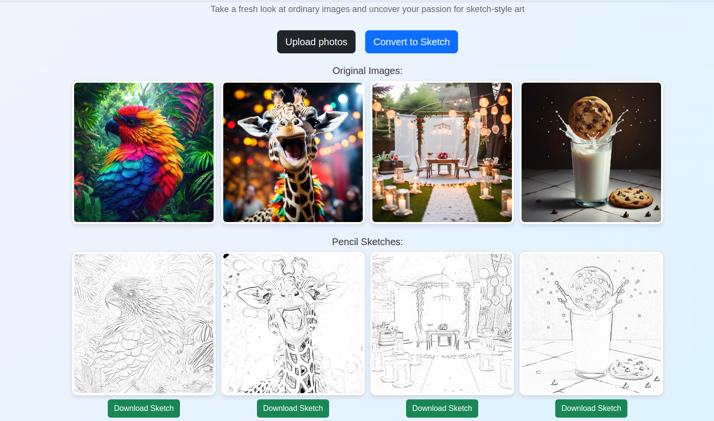

# image-to-pencil-sketch-app

## Steps Taken on the Backend
- Reading the image
- Convert to greyscale
- Invert the greyscale image to create the negative image
- Blur the image using GaussianBlur
- Invert the blurred image
- Mix up the greyscale with the inverted blurred image using cv2.divide() method

### Colab notebook link
https://colab.research.google.com/drive/18czKckoZgqsA2PGD8xbhgNPtpIvqXGRZ?usp=sharing